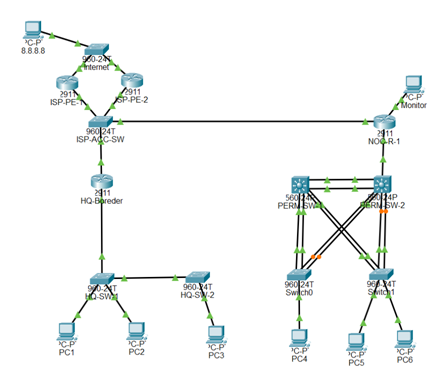
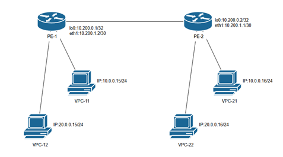
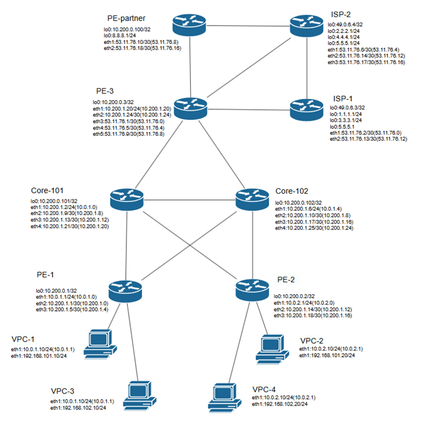
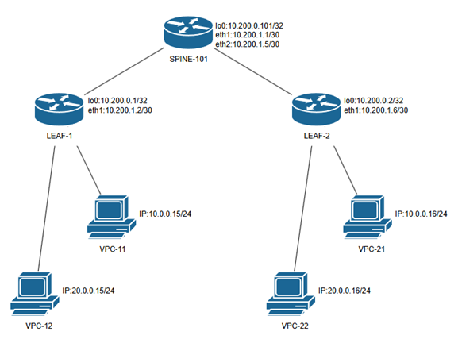

# Enterprise Network Architecture Labs

A comprehensive collection of advanced networking laboratory works focused on Enterprise, Service Provider (ISP), and Data Center (DC) architectures. 
Implemented using Cisco IOS and MikroTik RouterOS.

## Technologies & Protocols
*   **Data Center:** EVPN, VXLAN, Spine-Leaf architecture.
*   **Service Provider:** MPLS L3VPN, VRF-lite, Route Distinguishers (RD), Route Targets (RT), BGP Route Reflector, LDP.
*   **Routing:** OSPF (Underlay/IGP), eBGP/iBGP (Overlay), Static Routing.
*   **High Availability & Switching:** HSRP (Gateway redundancy), LACP (Link aggregation/Port-Channels), VLANs, 802.1Q Trunking, STP.

## Lab Overview

### Lab 1: HSRP, OSPF & Aggregation (Cisco)

Building a resilient corporate campus network. This lab focuses on gateway redundancy using HSRP, link redundancy via LACP (Port-Channels), and internal routing with OSPF.
*   **Key Results:** Achieved automatic failover for gateways and aggregated physical links for higher bandwidth and resilience.

### Lab 2: MPLS L3VPN with VRF (MikroTik)

Implementing isolated L3 VPN services for multiple clients over a shared MPLS infrastructure.
*   **Key Results:** Configured VRF instances with unique RDs and RTs, ensuring complete traffic isolation between Customer A and Customer B, even with overlapping IP subnets.

### Lab 3: OSPF, BGP & MPLS Integration (MikroTik)

Integrating interior (OSPF) and exterior (BGP) routing with MPLS transport. Features a BGP-free core and a Route Reflector for iBGP scalability.
*   **Key Results:** Successfully exchanged VPNv4 routes across the MPLS core while keeping core routers free of BGP client routes.

### Lab 4: EVPN/VXLAN Spine-Leaf (MikroTik)

Building a modern Data Center network using a two-tier Spine-Leaf topology with overlay networks.
*   **Underlay:** OSPF provides IP connectivity between Loopback interfaces.
*   **Overlay:** BGP EVPN distributes MAC and VNI information. Spine acts as Route Reflector.
*   **Key Results:** Dynamic VXLAN tunnels providing seamless L2 connectivity between servers in different racks (VLANs 10 & 20) over an L3 infrastructure.

## Key Learnings
*   Designing scalable networks using BGP-free core and Route Reflectors.
*   Implementing multi-tenancy using VRFs (L3 isolation) and VXLAN VNIs (L2 isolation).
*   Ensuring high availability at the gateway (HSRP) and link (LACP) levels.
*   Troubleshooting complex control-plane (BGP/OSPF) and data-plane (MPLS/VXLAN) operations.
